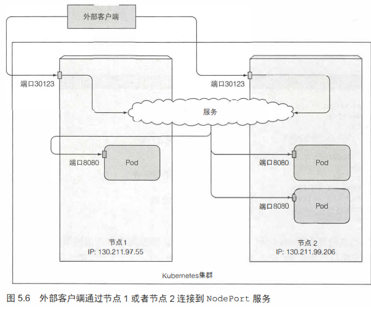
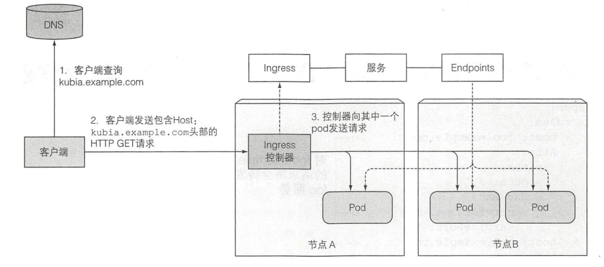

## 服务service

服务给一组pod提供单一不变的接入点

1. #### service简介
    * **服务创建**
        命令行：
        ```shell
        sudo kubectl expose rc kubia --type=LoadBalancer --name kubia-http
        ```
    * 文件：用yaml创建一个名为kubia的服务，在**80端口接收请求**并将外部的80连接路由到app=kubia的pod的8080端口上；此时尚未暴露，**没有external-IP和Port**
        ```shell
        #./kubia-svc.yaml
        apiVersion: v1
        kind: Service
        metadata:
            name: kubia
        spec:
            ports:
            -   port: 80 #svc的内部端口
                targetPort: 8080 #pod的端口
            selector:
                app: kubia
        ```

    * 在集群内部测试：
        * 创建一个pod，发送请求，记录相应，通过logs检查
        * 用ssh登录某个节点，curl
        * 通过kubectl exec在一个pod上执行, -- 表示kubectl命令结束。过程中http get请求由svc拦截并转
            ```shell
            sudo kubectl exec kubia -- curl -s http://10.110.119.194:80
            ```

    * 配置亲和性：如果希望请求每次转发给同一个pod，在svc.spec中配置。不支持cookie，因为kebernetes不在HTTP层面工作，而cookie是HTTP协议一部分，服务不知道它的存在
        ```shell
        sepc:
            sessionAffinity: ClinetIP
        ```

    * 多个端口：可以在ports写复数个port以暴露多个端口，，使其在**多个端口**上监听
        ```shell
        spec:
            ports:
            -   name: http
                port: 80
                targetPort: 8080
            -   name: https
                port: 443 
                targetPort: 8443
            selector:
                app: kubia
        ```
    * 对端口命名：书P128，在pod的yaml中增加posts属性：
        ```shell
        #in pod.yaml
        kind: Pod
        spec:
            containers:
            -   name: kubia
                ports:
                -   name: http
                    containerPort: 8080 #对应svc中的targetPort
                -   name: https
                    containerPort: 8443

        #in svc.yaml
        spec:
            ports:
            -   name: http
                port: 80
                targetPort: http #直接用名字即可
            -   name: https
                port: 443 
                targetPort: https
            selector:
                app: kubia
        ```
    * **服务发现**
        客户端的pod如何发现服务的IP和port
        * 通过环境变量发现：
        环境变量在pod**初始化**的时候配置，而这里的pod在svc**之前建立**，所以要先删除pod，使得新的pod配置svc信息
            ```shell
            #删除旧的pod，rc会自动新建
            $ sudo kubectl delete po --all
            #查看环境变量
            $ sudo kubectl exec kubia-xtvw2 env | grep SERVICE
            ...
            $ KUBIA_SERVICE_HOST=10.110.119.194
            $ KUBIA_SERVICE_PORT=80
            ...
            ```
        * 通过DNS发现：
        在kube-system命名空间下，其中一个pod为kube-dns，同时也有一个svc。每个容器的/etc/resolv.conf文件实现，pod上的进程的DNS查询都会被Kubemetes自身的DNS服务器响应。pod是否使用内部DNS由pod的spec.dnsPolicy决定
            * 通过全限定域名FQDN连接，如前端pod访问数据库：
            **backend-database.default svc.cluster.local**
                * backend-database 为服务名
                * default 为命名空间namespace
                * svc.cluster.local 为所有集群**本地服务**名称中使用的可配置集群域后缀
            * 在pod运行shell
                ```shell
                $ sudo kubectl exec -it kubia-xtvwf2 bash 
                #-i 交互模式，确保 stdin 开放，可以在 shell 中输入命令
                #-t 分配一个伪终端，使 stdout 可以回显出来
                #对exec，小心是否需要--
                root@kubia-xtvw2:/# curl http://kubia

                root@kubia-xtvw2:/# cat /etc/resolv.conf
                namesever: 10.96.0.10

                $ sudo kubectl get svc -n kube-system
                #可以看到coredn的ip为10.96.0.10，完全一致
                ```
            * **无法PING**，因为服务的集群IP是一个虚拟IP，只有在和端口结合时才有意义
            
            *   **踩坑**：CoreDNS 处于CrashLoopBackOff 状态，导致无法通过域名访问
                ```shell
                #查看pod
                $ sudo kubectl get po -n kube-sysytem
                # 发现coredns的两个pod处于CrashLoopBackOff状态

                #查看描述结点
                $ sudo kubectl describe po coredns-6967fb4995-7n5ks -n kube-system
                #查看日志
                $ sudo kubectl logs coredns-6967fb4995-7n5ks -n kube-system
                #输出
                $ ...
                $ [FATAL] plugin/loop: Loop (127.0.0.1:49443 -> :53) detected for zone ".", see https://coredns.io/plugins/loop#troubleshooting. Query: "HINFO 5688354173550604804.8931943943623004701."
                
                #查看resolv.conf位置在/etc/resolv.conf
                $ sudo kubectl edit cm coredns -n kube-system

                #编辑dns
                $ sudo vi /etc/resolv.conf 
                #添加namesever 114.114.114.114

                #删除已有的coredns即可，有rc或rs自动新建
                $ sudo kubectl delete po coredns-6967fb4995-7n5ks -n kube-system
                $ sudo kubectl delete po coredns-6967fb4995-xfs2r -n kube-system
                ```
2. #### 连接集群外部服务
    将服务暴露给集群外部，将服务重定向到外部IP和port
    * **EndPionts**：
        * 介于svc和pod之间的资源
            ```shell
            $ sudo kubectl describe svc kubia
            ...
            IP：svc的cluster-IP
            Port：svc在集群内部的端口
            Endpoints： pod的ip:port列表
            ...
            
            $ sudo kubectl get endpoints kubia
            ```
            svc**选择器**不直接连接 pod，而是用于构建 endpoints 存储 pod 的IP:Port 表作为中间件，对于有selector的svc，删除pod后若rc重建，endpoint会更新ip
            ```mermaid
            graph LR
            A(内部服务请求) --> B(svc)
            B --> C(endpoings)
            C --> D[pod1]
            C --> E[pod2]
            C --> F[pod3]
            ```
        * 为**没有selector的svc**手动构建endpoint，构造没有selector的svc，无selector，故不会自动构建endpoint。
        手动构造endpoint，与svc有相同的name，包含svc的目标ip和port，即服务的**目标定向由endpoint指定**
            ```shell
            #./external-service.yaml
            apiVersion: v1
            kind: Service
            metadata:
                name: external-service #应该与endpoint一致
            spec:
                ports: #无选择器
                -   port: 80
                    targetPort: 8080
            
            #./eternal-service-endpoint.yaml
            apiVersion: v1
            kind: Endpoints
            metadata:
                name: external-service
            subsets:
                -   addresses: #重定向到endpoint的目标ip
                    -   ip: 11.11.11.11
                    -   ip: 22.22.22.22
                    ports: #endpoint的目标端口
                    -   port: 80
            ```
            对于**外部服务迁移入**kubenetes的pod时，添加入**selector**即可；停止服务时，移除**selector**。
            服务的IP地址可以保持不变，同时服务的实际实现（endpoint的指向）却自动发生了改变
            
            ```shell
            $ sudo kubectl edit svc external-service
            # 手动加入
            ...
            selector:
                app: kubia
            ...
            
            $ sudo kubectl describe svc external-service
            # 此时slector和endpoins自动发生了改变

            # 如果删除selector，endpoint不会自动删除和变化
            ```
        * 为**外部服务**创建别名
            ```shell
            apiVersion: v1
            kind: Service
            metadata:
                name: external-service
            spec:
                type: ExternalName
                externalName: someapi.somecompany.com
                ports:
                -   port: 80        
            ```
        此时可以用域名externel-service.default.svc.cluster.local 或者 externel-service.default 或者 externel-service 访问外部服务。而且内部的客户端可以**直接连接外部**，用于DNS层面，可以**绕过服务代理**，服务也不会获得服务在集群的cluster-IP。当更换外部服务时：
        * 更改svc的external-name即可
        * 改为type: ClusterIP（默认的）然后加上endpoint或者selector

3. #### 将服务暴露给外部客户端
    * 类型设为NodePort，针对**结点 Node**，所有节点上保留一个端口（所有节点上都使用相同），将NodePort端口的流量重定向到具体服务，服务部分转发到pod。与ClusterIP相似只不过可以外部访问。如果是云服务器可能需要开防火墙firewalld和端口
    创建nodePort
        ```shell
        apiVersion: v1
        kind: Service
        metadata:
            name: kubia-nodeport
        spec:
            type: NodePort
            ports:
            -   port: 80   # Cluster-IP，集群内部IP的端口号
                targetPort: 8080 # Pod-IP，pod的端口号
                nodePort: 30123  # 通过集群各节点IP可访问的端口, 忽略它则随机
            selector:
                app: kubia
        
        $ firewall-cmd --zone=public --add-port=30123/tcp --permanent #开防火墙
        $ firewall-cmd --reload
        
        $ kubectl get nodes -o jsonpath='{.items[*].status.addresses[?(@.type=="ExternalIP")].address}'
        $ sudo kubectl get nodes -o yaml|grep address #获取nodeIP
        
        $ curl <clustr-ip>:80
        $ curl <node-ip>:30123
        ```

        
        
    * **LoadBalancer**
        * 设置类型为loadBalancer，负载均衡器由Kubernetes中的云基础设施提供（专门的设施，minikube没有），有独一无二的ip和端口。
        * **客户端**通过**负载均衡器**的特定 IP 连接到跨所有节点的**节点端口**，结点端口流量转发到**具体的svc**，然后svc调度转发到**node上的具体pod**
        * 即：客户先到LB，然后LB根据负载调整的转发到合适的主机的NodePort，之后的流程跟nodeport一样，这相当于NodePort和客户端之间用loadBalancer进行代理。
        * 创建，无需指定nodeport：
            ```shell
            apiVersion: v1
            kind: Service
            metadata:
                name： kubia-loadbalancer
            spec:
                type: LoadBalancer
                ports: #未指定NodePort，kubenetes自动分配
                -   port: 80
                    targetPort: 8080
                selector:
                    app: kubia
            ```
        * Web浏览器与亲和性：web通过http-alive连接，一个连接多此请求；curl每次请求都是一次连接。
        * **外部连接的特性**
            * 防止不必要网络跳数，可以限制仅重定向到接收结点上的pod,
                ```shell
                spec：
                    externalTrafficPolicy: Local
                ```
                缺点在于：
                * 若此时节点上无pod则**连接挂起**
                * 节点上pod数目不同则载荷不均匀
            * 跨节点通过NodePort接受时，数据包进行**源地址转换SNAT**，客户端的ip不记录，用Local策略可以解决

    * **使用ingress暴露服务**
        * 优点：
            * ingress(进入的权利、手段)，每个LoadBalancer都需要一个均衡负载器和ip；而ingress可以为多个服务提供访问，只需要一个ip，通过主机名和路径转发
            * ingress用同一个ip，根据域名进行转发，到某一个svc；相当于在多个svc和客户端之间套一个ingress
            * ingress在应用层(HTTP)操作，可以提供基于**cookie的亲和性**
        * 开启**ingress控制器**才可以使用**ingress 资源**，不同的kubernetes环境的控制器不同，对minikube：
            ```shell
            $ sudo minikube addons list #查看组件
            ...
            - ingress: disable #关闭状态
            ...
            $ sudo minikube addons enable ingress #开启ingress控制器
            # 查看get pod发现已经开启
            ...
            nginx-ingress-controller-7b465d9cf8-xktqz   0/1     ContainerCreating   0          27s
            ..
            ```
        * 创建ingress资源
            ```shell
            #./kubia-ingress.yaml
            apiVersion: extensions/v1beta1
            kind: Ingress
            metadata:
                name: kubia
            spec:
                rules:
                -   host: kubia.example.com #将该域名映射到服务
                    http:
                        paths:
                        -   path: / #将请求发送到kubia-nodeport服务svc的80端口
                            backend:
                                serviceName: kubia-nodeport
                                servicePort: 80 #对应svc的Port，是cluster-IP对应的port
            ```            
            某些云供应商如GKE要求ingress指向NodePort但这不是kubernetes的要求
        * 通过ingress访问，通常ingress控制器**不会转发给服务svc**，而是利用svc的endPiont直接选一个pod，然后之间发给pod
            ```shell
            $ sudo kubectl get ingress
            #获取adress为ip
            $ sudo vi/etc/hosts
            #添加
            ip kubia.example.com

            $ curl http://kubia.example.com
            ```
        * 暴露多台主机、多个服务
            ```shell
            apiVersion: extensions/v1beta1
            kind: Ingress
            metadata:
                name: kubia-mult
            spec:
                rules:
                -   host: foo.example.com #将该域名映射到服务
                    http:
                        paths:
                        -   path: /kubia #将请求发送到kubia-nodeport服务svc的80端口
                            backend:
                                serviceName: kubia
                                servicePort: 80
                        -   path: /foo 
                            backend:
                                serviceName: foo
                                servicePort: 80
                -   host: bar.example.com 
                    http:
                        paths:
                        -   path: / #将请求发送到kubia-nodeport服务svc的80端口
                            backend:
                                serviceName: bar
                                servicePort: 80
            ```
        
            
        * 无法拉取镜像
            ```shell
            # nginx-ingress-controller 从quay.io拉取镜像，有时因为不可抗力因素失败
            sudo kubectl get po nginx-ingress-controller-7b465d9cf8-xktqz -n kube-system -o yaml 
            # 目前在国内找一个能用的quay.io镜像也太难了
            sudo docker pull xxx/nginx-ingress-controller:0.23.0
            sudo docker tag xxx/nginx-ingress-controller:0.23.0 quay.io/kubernetes-ingress-controller/nginx-ingress-controller:0.23.0
            sudo kubectl delete po nginx-ingress-controller-7b465d9cf8-jm75z  -n kube-system

            ```
        * Ingress的TLS传输：HTTPS流量
            * 创建TLS认证，**客户端**与**ingress控制器**加密通信，控制器与后端pod不加密。将证书和私钥附加到secret中，ingress处理TLS相关内容即可，后端pod只用接收处理http即可
                ```shell
                $ openssl genrsa -out tls.key 2048
                $ openssl req -new -x509 -key tls.key -out tls.cert -days 360 -subj /CN=kubia.example.com
                
                #创建secret
                $ sudo kubectl create secret tls tls-secret --cert=tls.cert --key=tls.key
                secret "tls-secret" create
                ```
                
            * 更新ingress
                私钥和证书现在存储在名为 tls-secret 的 Secret 中，**更新 Ingress 对象**，不需要删除重建（```edit tls tls-secret```是否可以？）
                ```shell
                #./kubia-ingress-tls.yaml
                apiVersion: extensions/v1beta1
                kind: Ingress
                metadata:
                    name: kubia
                spec:
                    tls:
                    -   hosts:
                        -   kubia.example.com #接收来自该域名主机的TLS连接
                        secretName: tls-secret #从tls-secret中获取私钥和证书
                    rules:
                    -   host: kubia.example.com #将该域名映射到服务
                        http:
                            paths:
                            -   path: / 
                                backend:
                                    serviceName: kubia-nodeport
                                    servicePort: 80
                ```
                ```
                $ kubectl apply - f kubia-ingress-tls.yaml #通过文件更新，避免删除
                $ curl -k -v https://kubia.example.com/kubia 

                *   Trying 192.168.106.10...
                ...
                * SSL connection using TLS1.2 / ECDHE_RSA_AES_256_GCM_SHA384
                * 	 server certificate verification SKIPPED
                ...
                < HTTP/1.1 200 OK
                < Server: nginx/1.15.9
                < Date: Fri, 02 Jul 2021 01:57:29 GMT
                < Transfer-Encoding: chunked
                < Connection: keep-alive
                < 
                You've hit kubia-mjhkx
                * Connection #0 to host kubia.example.com left intact
                ```

4. #### pod就绪信号
    pod构造出来及作为服务的后端，但是pod可能需要时间进行配置，若pod未准备就绪则不会被加入服务中，有3种：
    * HTTP GET探针
    * TCP socket探针，连接建立即可
    * Exec探针，进程执行命令，由退出的状态码决定
    修改RC kubia：
        ```shell
        $ sudo kubectl edit rc kubia
        #在vi中修改
        apiVersion: v1
        kind: ReplicationController
        metadata:
          name: kubia
        spec:
          replicas: 3
          selector:  #选择器 指定标签
            app: kubia
          template:  #pod模板
            metadata:
              labels:
                app: kubia
            spec:
              containers:
              - name: kubia
                image: luksa/kubia
                readinessProbe: #新加探针
                  exec:
                    command:
                    - ls
                    - /var/ready
                  initialDelaySeconds: 100  #首次执行时间
                  timeoutSeconds: 5     #每次探针的超时时间
                #
                ports:
                - containerPort: 8080
        ```
        定期执行```ls /var/ready```路径不存在，一直失败。注意**更改RC的pod模板对现有pod没有影响**，可以删除pod，新的pod处于```READY 0/1```状态，执行:```shell
        sudo kubectl exec kubia-zsaff -- touch /var/ready```则处于```ready 1/1```状态。可以用```describe```查看探针livenessProbe
    * 不要用探针来移除 pod，应该通过删除 pod 或更改 pod 标签，而不是手动更改探针来从服务中手动移除pod，如在pod和svc.selector添加或删除```enable=true```

5. #### 用 headless 发现独立pod
    当```svc.spec.clusterIP: None```时，则DNS返回支持服务的全部pod的ip，否则返回集群ip，例子
    ```shell
    #./kubia-svc-headless.yaml
    apiVersion: v1
    kind: Service
    metadata:
        name: kubia-headless
    spec:
        clusterIP: None #svc集群集群ip
        ports:
        -   port: 80
            targetPort: 8080
        selector:
            app: kubia
    ```
    ```
    # 运行DockerHub上的tutum/dnsutils镜像执行nslookup
    $ sudo kubectl run dnsutils --image=tutum/dnsutils --generator=run-pod/vl --command -- sleep infinity    
    $ sudo kubectl exec dnsutils nslookup kubia-headless
    # 返回svc中两个ready的pod的FQDN和ip
    Name:	kubia-headless.default.svc.cluster.local
    Address: 172.17.0.2
    Name:	kubia-headless.default.svc.cluster.local
    Address: 172.17.0.11
    #若非headless
    $ sudo kubectl exec dnsutils nslookup kubia
    # 返回svc的集群ip

    #查看全部pod的ip
    kind: Service
    metadata:
        annotations:
        service.alpha.kubernetes.io/tolerate-unready-endpoints: "true"
    ```

6. #### 排除故障
    * 检查svc的```CLUSTER-IP```和```EXTERNAL-IP```是否是客户端可访问的位置
    * 注意连接的端口应该是服务的公开的端口（NodePort），而不是代理的 Pod 目标端口（Port）。
    * 检查端口配置，是否连接到svc公开的端口（结点的端口）， 而不是targetPort（pod的端口）
    * 不要尝试 ping 服务的IP，服务 IP 是虚拟 IP，本身并不存在，无法ping通，只有和提供端口一起使用才有意义
    * 如果定义存活探针或就绪探针要确保 Pod 已经准备就绪。
    * 使用 ```kubectl describe svc``` 和 ```kubectl get endpoints``` 检查 SVC 是否正确代理 Pod。
    * 是否为服务设置了别名，原本为```kubia.default.svc.cluster.local```，```externalName: someapi.somecompany.com```
    * 如果使用 FQDN（全限定域名）来访问服务但不起作用，可以试试使用 CLUSTER-IP 是否可以访问。
    * 直接使用 Pod IP 访问服务，确保 Pod 可以正确处理请求。
    * 通过kubectl apply命令修改Kubemetes资源
    * 使用kubectl run --generator= run-pod/vl运行临时的pod


7. #### ip相关总结
    |IP|端口|解释|
    |--|--|  --|  
    |pod-IP|targetPort|```get po -o wide```可以查看，```IP:PORT```对应 endpoints|
    |cluster-IP|Port| service的内部ip，```get svc```可查|
    |external-IP|NodePort| 外部访问ip，```get svc```|
    