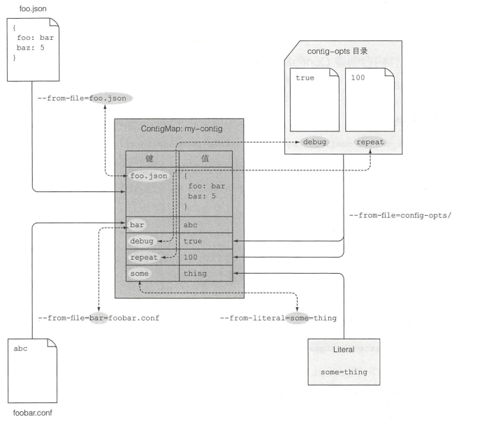

## ConfigMap和Secret：配置应用程序
    
#### 1. 配置应用程序配置选项的几种方式：

* 向容器传递命令行参数，只能用于初始阶段以及配置较少的情况
* 为容器设置环境变量，在Docker容器中很常见
* 配置文件：写入镜像存在安全问题，挂载卷要确保在容器启动前写入

#### 2.Docker中用命令行传递参数
* Dockerfile中的指令包括：
    * ENTRYPOINT，docker在启动时调用的程序
    * CMD，向ENTRYPOINT传递的参数
    指令形式：
    * exec形式：```ENTRYPOINT ["node","app.js"]```，主进程```PID=1```为node进程
    * shell形式：```ENTRYPOINT node app.js```，此时主进程```PID=1```为shell进程，shell进程是多余的，造成浪费

    运行镜像命令：
    ```shell
    $ docker run <image> <arguments>  # arguments会覆盖CMD的默认参数
    ```
* 使用kubernetes覆盖命令和参数
    ```yaml
    kind: Pod
    spec:
        contaiers: 
        -   image: some/iamge
            command: ["/bin/command"] #覆盖entrypoint,可以用环境变量
            args: ["arg1","arg2","arg3"] #覆盖CM，这两个字段创建后无法修改？RC中可以吗？
            args: #这种形式也可以
            - foo
            - bar
            - "15" # 字符串不需要引号，字符需要引号
    ```
#### 3. 设置环境变量
在pod中指定环境变量
```yaml
kind: Pod
spec:
    containers:
    -   image: luksa/fortune:env
        name: html-genetator
        env:
        -   name: INTERVAL #添加环境变量
            value: "30"
        -   name: FIRST_VAR
            value: "foo"
        -   name： SECOND_VAR # 可以用于command和args
            value: "$(FIRST_VAR)bar"
```

#### 4. 用ConfigMap解耦配置
配置的关键在于可以在多个环境中区分配置选项，从源码中分离，可以频繁变更。**ConfigMap** 是一个**键值对**，值可以是短字面量或**配置文件**，映射内容之间传递给容器。应用无须感知CM存在。CM可以在不同命名空间中有同名清单，pod通过名称引用CM，便于在不同环境使用不同配置
* 创建CM：
    * 通过命令行
        ```shell
        $ sudo kubectl create configmap fortune-config --from-litetal=sleep-interval=25 
        #CM的key是一个合法DNS子域，包含数字字母，点，下划线
        #多个键值对
        $ sudo kubectl create configmap fortune-config --from-litetal=sleep-interval=25 --from-litetal=foo=bar
        #从文件引入,在当前目录搜索该文件，键名默认config-file，也可以自己设置
        $ sudo kubectl create configmap my-config --from-file=config-file.conf  
        $ sudo kubectl create configmap my-config --from-file=filename=config-file.json 
        #引入文件夹下全部文件
        $ sudo kubectl create configmap my-config --from-file=config-files  
        ```
        读入后文件内容成为条目的值
        
    * 通过yaml创建
        ```yaml
        apiVersion: v1
        kind: ConfigMap
        metadata:
            name: test-cm
        data:
            numberd: "25" #数字
            stringd: val string #字符串
        ```
* 在pod中使用CM
    * 给容器做环境变量，如果CM不存在则该**容器**失败，其它容器正常启动，CM创建后该容器自动启动
        ```yaml
        #./fortune-pod-env-configmap.yaml
        apiVersion: v1
        kind: Pod
        metadata:
            name: fortune-env-from-configmap
        spec:
            containers:
            -   image: luksa/fortune:env
                env:
                -   name: INTERVAL #环境变量名
                    valueFrom: 
                    configMapKeyRef: #从CM获取value，非固定值
                        name: fortune-config #CM名字
                        key: sleep-interval #CM中的key
                        optional: true #CM不在是也可以启动
        ```
        一次性传递CM全部条目
        ```yaml
        spec:
            containers:
            -   image: some/image
                envFrom: #不是env
                -   prefix: CONFIG_ #添加前缀
                    configMapRef: #不是keyRef
                        name: my-config-map #CM名字
        ```
        做环境变量时，应该注意**拼接后的key**是否是合法的**环境变量名**，如CONFIG_FOO-BAR会被忽略
    * 作命令行参数，本质上还是作为环境变量使用，因为arg不能直接引用CM
        ```yaml
        #in a pod manifest
        spec:
            containers:
            -   iamge: luksa/fortune:args
                env:
                -   name:INTERVAL
                    valueFrom:
                        configMapKeyRef:
                            name: fortune-config
                            key: sleep-interval
                args: ["$(INTERVAL)"]
        ```
    * 利用配置文件传入，用configMap卷挂载
        * 这里仍然用fortune和nginx作一个web服务，让nginx压缩给客户的响应。新建配置文件```./configmap-files/my-nginx-config.conf```，同时在```./configmap-files/sleep-interval```中为fortune配置睡眠值为25
        ```shell
        $ sudo kubectl configmap fortune-config --from-file=configmap-files
        ```
        * 创建nginx的pod
        ```yaml
        # ./fortune-pod-configmap-volume.yaml
        apiVersion: v1
        kind: Pod
        metadata:
            name: fortune-configmap-volume
        spec:
            containers:
            -   image: luksa/fortune:env #fortune容器
                name: html-generator
                env:
                -   name: INTERVAL #从CM获取环境变量
                    valueFrom：
                        configMapKeyRef:
                            name: fortune-config
                            key: sleep-interval
                volumeMounts:
                -   name: html #读写html文件，emptyDir卷挂载
                    mountPath: /var/htdocs
            -   image: nginx:alpine
                name: web-server
                volumeMounts:
                -   name: html #读写html文件，emptyDir卷挂载
                    mountPath: /var/htdocs
                    readyOnly: true
                -   name: config #nginx默认配置文件/etc/nginx/conf.d会自动嵌入该文件下的全部.conf文件
                    monutPath: /etc/nginx/conf.d 
                    readOnly: true
                -   name: config
                    mountPath: /tmp/whole-fortune-config-volume
                    readOnly: true
                ports:
                -   containerPort: 80
                    name: http
                    protocl: TCP
            volumes:
            -   name: html #emptyDir卷
                emptyDir: {}
            -   name: config #将CM作为卷
                configMap:
                    name: fortune-config
        ```
        ```shell
        $ sudo kubectl port-forfawrd fortune-configmap-volume 8080:80 &
        $ curl -H "Accept-Encoding: gzip" -I localhost:8080
        ```
    * 仅在卷中暴露部分文件
        ```yaml
        volumes:
        -   name: config
            configMap:
                name: fortune-config
                items: #使用item确定只暴露部文件
                -   key: my-nginx-config.conf #cm中的key
                    path: gzip.conf #条目的值存储在该文件中，相当于重命名，挂载到的路径
        ```
    * 挂载不影响其他文件
        挂载时会隐藏原本该路径下的其他文件，使用subpath可以之挂载单个文件或文件夹而不影响其他文件
        ```yaml
        spec:
            volumes:
            -   name: myvolume
                mountPath: /etc/some.conf #仅附加挂到载到该文件，挂载整个卷会覆盖etc目录，容器可能崩溃
                subPath: some.conf #被挂载的item
        ```
    * 权限设置，默认644```(-rw-r-r--)```
        ```yaml
        volumes:
        -   name: config
        -   name: config #将CM作为卷
            configMap:
                name: fortune-config
                defaultMode: "6600" #-rw-rw------
        ```
    * 更新configMap实现更新热配置
        configMap更新后，卷中引用他的文件也会更新（往往需要数分钟）。但是容器中的程序很可能不会主动更新，需要主动通知。挂载到已存在文件夹的文件**不会自动更新**，即subPath。
        * 自动更新
        ```shell
        sudo kubectl exec -it fortune-confingmap-volume -c web-server -- ls  -lA /etc/nginx/conf.d
        ```
        可以可以看到配置文件是通过..data软连接的，更新后，kubernetes会重新写入文件并软连接

#### 5.使用Secret传递敏感数据
* Secret结构与CM相似，同样是键值对，可以通过命令行传递或者暴露为文件，**secret只在内存中存储，不会进入磁盘**，1.7以前secret在主节点非加密存储，之后加密存储。通过```describe pod```查看任意pod可以看到，挂载了默认的 default-token-tlw5s
    ```shell
    $ sudo kubectl describe pod kubia

    Mounts:
        /var/run/secrets/kubernetes.io/serviceaccount from default-token-tlw5s (ro)
    ...
    Volumes:
    default-token-tlw5s:
        Type:        Secret (a volume populated by a Secret)
        SecretName:  default-token-tlw5s
        Optional:    false
    ```
    该secret包含三部分ca.crt,namespace,token
    ```shell
    $ sudo kubectl exec kubia ls /var/run/secrets/kubernetes.io/serviceaccount/
    #访问容器挂载位置可以看到已经挂载
    ca.crt
    namespace
    token
    ```
* 创建Secret，为fortune提供https服务，https知识参考：https://zhuanlan.zhihu.com/p/60033345，https://www.zhihu.com/question/24294477
    ```shell
    mkdir fortune-https
    cd fortune-https
    #生成私钥和证书
    openssl genrsa -out https.key 2048
    openssl req -new -x509 -key https.key -out https.cert -days 3650 -subj /CN=www.kubia-example.com
    #生成一个明文文件作对比
    echo bar > foo
    #创建secret
    kubectl create secret generic fortune-https --from-file=https.key --from-file=https.cert --from-file=foo
    # 查看内容
    sudo kubectl get secret fortune-https -o yaml
    ...
    data：
        foo: YmFyCg== #已经加密 
        https.cert: LS0tLS1...
        https.key: LS0tLS1...
    ...
    ```
    secret条目（**最大1M**）经过Base64加密，可以将文本和二进制文件转化为文本；此外也可以用stringData属性设置只写的文本值，在展示时会被加密后进入data属性。而在pod中读取时，secret会被直接解码

* 在pod中使用secret
    ```shell
    #修改cm的配置
    $ sudo kubectl edit configmap fortune-config
    #nginx配置改为
    server {
        listen              80;
        listen              443 ssl;
        server_name         www.kubia-example.com;
        ssl_certificate     certs/https.cert;
        ssl_certificate_key certs/https.key;
        ssl_protocols       TLSv1 TLSv1.1 TLSv1.2;
        ssl_ciphers         HIGH:!aNULL:!MD5;

        location / {
            root   /usr/share/nginx/html;
            index  index.html index.htm;
        }
    }
    ```
    创建pod挂载secret
    ```yaml
    #./fortune-pod-https.yaml
    apiVersion: v1
    kind: Pod
    metadata:
      name: fortune-https
    spec:
      containers:
      - image: luksa/fortune:env #fortune镜像
        name: html-generator
        env:
        - name: INTERVAL #从cm引入环境变量
          valueFrom: 
            configMapKeyRef:
            name: fortune-config #直接从cm引入
            key: sleep-interval
        volumeMounts: #挂载
        - name: html
          mountPath: /var/htdocs
      - image: nginx:alpine #nginx镜像
        name: web-server
        volumeMounts:
        - name: html #挂载
          mountPath: /usr/share/nginx/html
          readOnly: true
        - name: config #挂载cm的配置
          mountPath: /etc/nginx/conf.d
          readOnly: true
        - name: certs #挂载证书
          mountPath: /etc/nginx/certs/
          readOnly: true
        ports:
        - containerPort: 80
        - containerPort: 443
      volumes:
      - name: html #声明emptyDir卷
        emptyDir: {}
      - name: config #引用CM配置文件
        configMap:
          name: fortune-config
          items: #仅暴露部分
          - key: my-nginx-config.conf
            path: https.conf
      - name: certs #引用secret
        secret:
          secretName: fortune-https
    ```
    ```shell
    $ sudo kubectl port-forward fortune-https 8463:443 #8443被API服务器占用
    $ curl https://localhost:8463 -k #没有映射域名，靠证书验证应该不行
    ```
* 挂载于内存中
    ```shell
    $ sudo kubectl exec fortune-https -c web-server -- mount I grep certs
    tmpfs on /etc/nginx/certs type tmpfs (ro,relatime)
    ```
    可以看到是通过tmpfs挂载到内存的
* 通过环境变量暴露
    缺点在于启动时可能会**打印环境变量**；而且子进程会继承父进程环境变量，如果用**第三方程序**可能泄露。总的来说因为环境变量本身不是保密的，所以可能暴露secret的item
    ```yaml
    env:
    -   name: FOO_SECRET
        valueFrom:
            secretKeyRef: #于cm的 区别
                name: fortune-https
                key: foo
    ```

* 拉取私有镜像
    如果从私有仓库拉取镜像，则需要kubernetes包含相应证书。仅包含一个.dockercfg一个条目，该条目通常是docker login时自行创建
    * 创建包含证书的secret
        ```shell
        kubectl create secret docker-registry my-dockerhub-secret \
        --docker-username=myusername \
        --docker-password=mypassword \
        --docker-email=my.email@provider.com
        ```
    * 在pod定义时引用secret
    ```yaml
    spec:
        imagePullSecret:
        - name: mydockerhubsecret
        container:
        ...
    ```