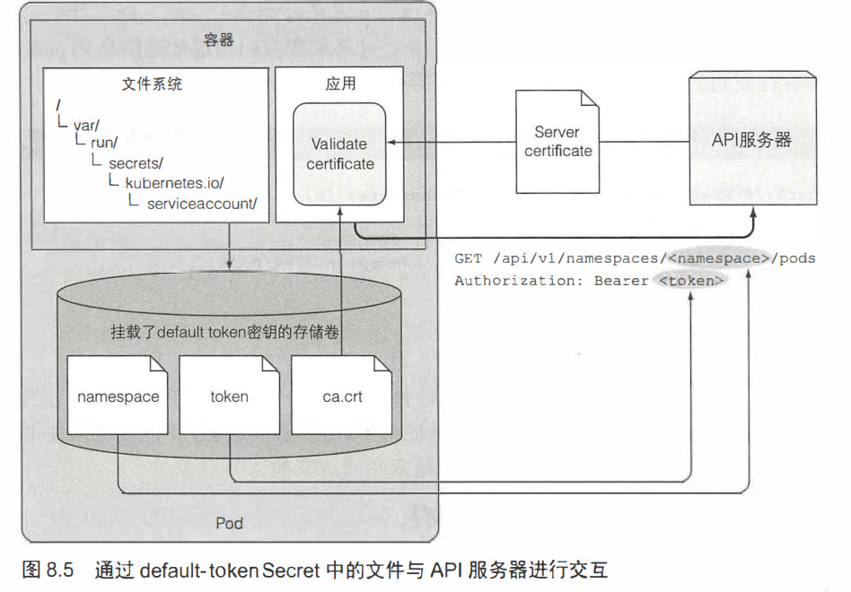

## 从应用访问pod元数据以及其他资源

#### 1.通过downward API传递元数据
    
提前不知道的数据，如pod的ip、主机名、pod名；别处已经定义的数据，如标签、注解
* DowloadAPI通过环境变量或者文件（downladAPI卷）进行传递，通过在pod中定义而不是访问，可用的元数据有：
    * pod的名称
    * pod的IP
    * pod的标签、注解：只能通过卷暴露
    * pod的命名空间
    * pod运行的结点名称
    * pod归属的服务账户名：访问API服务器时用来进行身份验证的账户，12章介绍
    * 每个容器请求的CPU和内存使用量
    * 每个容器可用的的CPU和内存使用量，14章介绍

* 通过环境变量暴露元数据
    ```yaml
    # ./downward-api-evc.yaml
    apiVersion: v1
    kind: Pod
    metadata:
      name: downward
    spec:
      containers:
      - name: main
        image: busybox
        command: ["sleep", "9999999"] #初始命令
        resources: #请求的资源
          requests:
            cpu: 15m
            memory: 100Ki #改为6M
          limits:
            cpu: 100m
            memory: 4Mi #改为10M
        env:
        - name: POD_NAME #pod名
          valueFrom:
            fieldRef:
              fieldPath: metadata.name #直接从manifest引入
        - name: POD_NAMESPACE
          valueFrom:
            fieldRef:
              fieldPath: metadata.namespace
        - name: POD_IP
          valueFrom:
            fieldRef:
              fieldPath: status.podIP
        - name: NODE_NAME
          valueFrom:
            fieldRef:
              fieldPath: spec.nodeName
        - name: SERVICE_ACCOUNT
          valueFrom:
            fieldRef:
              fieldPath: spec.serviceAccountName
        - name: CONTAINER_CPU_REQUEST_MILLICORES
          valueFrom:
            resourceFieldRef: #从mainfest的resource部分引入
              resource: requests.cpu
              divisor: 1m #对资源部分，设定基数单位，millicore千分之一核CPU
        - name: CONTAINER_MEMORY_LIMIT_KIBIBYTES
          valueFrom:
            resourceFieldRef:
              resource: limits.memory
              divisor: 1Ki
    ```
    ```shell
    #pod创建失败，报错如下
    $ sudo kubectl describe po downward
    ...
    Warning  Failed     3m54s (x8 over 6m45s)  kubelet            Error: Error response from daemon: Minimum memory limit allowed is 6MB
    # 默认内存最小6M，修改后即可
    $ sudo kubectl exec downward enc #查看环境变量
    CONTAINER_CPU_REQUEST_MILLICORES=15
    CONTAINER_MEMORY_LIMIT_KIBIBYTES=8192
    ```
* 通过卷文件暴露元数据
    ```yaml
    # ./downward-api-volume.yaml
    apiVersion: v1
    kind: Pod
    metadata:
      name: downward
      labels: #设置标签以供暴露
        foo: bar
      annotations: #设置备注以供暴露
        key1: value1
        key2: |
          multi
          line
          value
    spec:
      containers:
      - name: main
        image: busybox
        command: ["sleep", "9999999"]
        resources:
          requests:
            cpu: 15m
            memory: 100Ki
          limits:
            cpu: 100m
            memory: 4Mi
        volumeMounts: #挂载卷
        - name: downward #卷名称
          mountPath: /etc/downward #挂载路径
      volumes:
      - name: downward #设置卷的名称
        downwardAPI:   #指定类型为downwardAPI
          items:       #仅暴露部分文件
          - path: "podName" #文件的在卷中的地址
            fieldRef:
              fieldPath: metadata.name #对应manifest的值
          - path: "podNamespace"
            fieldRef:
              fieldPath: metadata.namespace
          - path: "labels"
            fieldRef:
              fieldPath: metadata.labels
          - path: "annotations"
            fieldRef:
              fieldPath: metadata.annotations
          - path: "containerCpuRequestMilliCores"
            resourceFieldRef:          #从资源中获取
              containerName: main      #容器名
              resource: requests.cpu
              divisor: 1m
          - path: "containerMemoryLimitBytes"
            resourceFieldRef:
              containerName: main
              resource: limits.memory
              divisor: 1
    ```
    ```shell
    $ sudo kubectl exec downward -- ls -lL /etc/downward #查看文件
    $ sudo kubectl exec downward -- cat /etc/downward/labels #查看文件
    ```
    通过卷暴露的优点：
    * 在**卷**中引用容器级数据时要指明**容器名**(如cpu和memory，使用resourceFieldRef)，因为卷是pod级，如果只有一个容器也是一样的
    * 标签和注释应该通过文件暴露，因为如果修改pod的标签和注释，如果通过环境变量暴露则环境变量不会改变，而通过文件暴露可以看到，便于获取最新值
    * 环境变量只能获取容器自身的资源信息（相当于容器自身的初始化），而文件在pod级别的卷上，一个容器可以**获取别的容器的信息**
  
  #### 2. 与kubernetes API服务器进行互交
    便于从pod内部访问其他pod和集群的信息
    * 本机尝试kubernetes REST API
      ```shell
      #获取api地址，但是额访问，没有授权
      $ sudo kubectl cluster-info
      #使用自带的代理
      $ sudo kubectl proxy
      $ curl localhost:8001
      #可以看到创建Pod、Service这些资源时定义的API组和版本信息
      {
      "paths": [
        "/api",
        "/api/v1",
        "/apis/",
        ...
        k8s.io/v1beta1",
        "/apis/apiextensions.k8s.io",
        "/apis/apiextensions.k8s.io/v1beta1",
        ...
        "/apis/apps/v1",
        "/apis/apps/v1beta1",
        "/apis/apps/v1beta2",
        "/apis/authentication.k8s.io",v1",
        ...
      }
      #新建job并通过api获取json信息
      $ sudo kubectl create -f my-job.yaml
      $ curl http://localhost:8001/apis/batch/v1/namespaces/default/jobs/myjob
      ```
  * 从pod内部与API服务器交互
    
    * 需要关注三件事
      * 确定API服务器位置
      * 确保API服务器不被茂名顶替（中间人攻击）
      * 通过服务器认证
    
    * 运行一个什么也不做的pod，在pod的容器中用```kubectl exec```运行脚本，该脚本用curl访问API服务器。
      ```yaml
      # ./curl.yaml
      apiVersion: v1
      kind: Pod
      metadata:
        name: curl
      spec:
        containers:
        - name: main
          image: curlimages/curl #tutum/curl镜像已经没有了
          command: ["sleep", "9999999"]
      ```
      进入该容器的shell，原本通过```kubectl get svc```可以看到服务kubernetes即为其端口和地址；而且每个服务在环境变量都可以看到（第四章），提供的是cluster-iP以及port
      ```shell
      #连接到容器
      $ sudo kubectl exec -it curl sh
      #查看环境变量，全部服务
      / $ env | grep SERVICE 
      KUBIA_NODEPORT_SERVICE_HOST=10.105.14.118
      KUBERNETES_SERVICE_PORT=443
      KUBIA_NODEPORT_SERVICE_PORT=80
      KUBIA_SERVICE_HOST=10.110.119.194
      KUBERNETES_SERVICE_PORT_HTTPS=443
      KUBERNETES_SERVICE_HOST=10.96.0.1
      KUBIA_SERVICE_PORT=80
      # kubernetes API服务器信息，返回cluster-IP
      / $ env | grep KUBERNETES_SERVICE
      KUBERNETES_SERVICE_PORT=443
      KUBERNETES_SERVICE_PORT_HTTPS=443
      KUBERNETES_SERVICE_HOST=10.96.0.1
      # 通过域名进行访问
      / $ curl -k  https://kubernetes
      # 查看dns服务器配置
      / $ cat /etc//resolv.conf 
      nameserver 10.96.0.10
      search default.svc.cluster.local svc.cluster.local cluster.local
      options ndots:5
      # 查看集群的dns服务，ip一致
      $ sudo kubectl get svc -o wide -n kube-system
      kube-dns               ClusterIP   10.96.0.10       <none>        53/UDP,53/TCP,9153/TCP   154d    k8s-app=kube-dns
      ```
    * **踩坑**， 目前minikube里的角色带有访问控制RBAC，可以手动关闭使得**所有角色都有权限**
      ```shell
      $ sudo kubectl create clusterrolebinding permissive-binding \
      --clusterrole=cluster-admin \
      --group=system:serviceaccounts
      ```
    * 验证服务器身份
      默认secret名为```default-token-tlw5s```记录了账户的CA证书，被自动挂载到每个pod的```/var/run/secrets/kubenetes.io/serviceaccount/```，进入容器研究一下ca证书，尝试访问API服务器，```curl --cacert```应该是指定受信任的CA证书
      ```shell
      # 直接访问，可以看到服务器为验证，拒绝连接
      / $ curl https://kubernetes
      ...curl failed to verify the legitimacy of the server and therefore could not establish a secure connection to it....
      # 在容器中查看
      / $ ls /var/run/secrets/kubernetes.io/serviceaccount/
      ca.crt     namespace  token
      # 尝试通过CA证书访问API服务器，通过验证、可以连接但是未授权，403
      / $ curl --cacert /var/run/secrets/kubernetes.io/serviceaccount/ca.crt https://kubernetes
      ```
      获取API服务器的授权，通过默认secret的token文件来获取服务器验证
      ```shell
      # 加载证书到环境变量
      / $ TOKEN=$(cat /var/run/secrets/kubernetes.io/serviceaccount/token)
      #返回，未认证
      ...
      "message": "forbidden: User \"system:anonymous\" cannot get path \"/\"",
      ...
      # 添加token
      / $ export TOKEN=$(cat /var/run/secrets/kubernetes.io/serviceaccount/token)
      #访问
      / $ curl -H "Authorization: Bearer $TOKEN" https://kubernetes
      # 获得命名空间
      curl -H "Authorization: Bearer $TOKEN" https://kubernetes   
      ```
    * 其他HTTP请求的方法，可以通过POST、GET、PUT/PATCH、DELETE来进行CRUD操作，但是需要指定命名空间
    

  * 通过ambassador容器与API服务器交互
    如果关闭了对服务器的验证功能，在pod中使用ambassador容器，在其中运行```kubectl proxy```进行代理，因为在同一个pod，共享同样的回送网络接口(回环地址、localhost)
    ```yaml
    ./curl-witj-ambassador.yaml
    apiVersion: v1
    kind: pod
    metadata:
      name: curl-with-ambassador
    spec:
      containers:
      - name: main
        image: curlimages/curl
        command: ["sleep", "9999999"]
      - name: ambassador
        image: luksa/kubectl-proxy:1.6.2
    ```
    进入main容器尝试互交
    ```shell
    $ sudo exec -it curl-with-ambassador -c main sh
    \ $ curl localhost:8001 #可以正常访问
    ```
  
  * 使用库互交
    官方
    * Golang client: https://github.com/kubemetes/client-go
    * Python: https://github.com/kubemetes-incubator/client-python
    
    非官方：
    * Fabric8维护的Java客户端: https://github.com/fabric8io/kubemetes-client
    * Amdatu维护的Java客户端: https://bitbucket.org/amdatulabs/amdatu-kubemetes
    * 中文版教程P251

    Kubernetes API 服务器在/swaggerapi 下暴露 Swagger API 定义，在 /swagger.json 下暴露 OpenAPI 定义.使用```--enable-swagger-ui=true```选项运行 API 服务器激活swagger API， 在minikube中，使用```minikube start --extra-config=apiserver.Features.Enable-SwaggerUI=true```在开启前激活，可以在```http(s)://<api server><port>/swagger-ui```访问