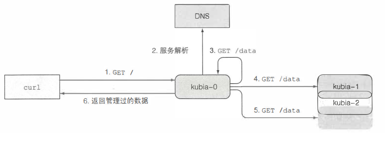

## StatefuslSet有状态多副本部署

#### 1. 复制有状态pod
  * RS中的pod除了IP和主机名不同外往往**没有别的差异**。如果RS中描述一个PVC则其全部的pod副本都指向同一个卷，不能实现每个pod有独立存储的分布式
    * 手动创建pod
    * 为每个pod手动创建rs，副本数为1
    * 使用同一个卷**不同目录**，不能在模板中指定，只能pod自行选择，存在瓶颈

  * 为pod维护稳定的网络标识：pod重启时主机名和IP改变，然而通常有状态分布式应用会在每个成员的配置中列出其他成员的主机名和IP。
    * 可以通过为每个pod单独分配svc，但是缺点很多，pod无法知道svc的ip，不能在其他pod中自行注册
  
#### 2. StatefulSet介绍
  * StatefulSet中没一个pod有稳定的的名字和状态
    * 与RS比较：
      * RS和RC的实例像农场的牛，可以随意替换
      * StatefulSet的实例像宠物，要保证完全一致的状态和标识，特点在于有着**独立的卷和规律（固定）的名字**
    * 提供稳定标识
      * StatefulSet创建的pod有一个从0开始的可预知的顺序索引，体现在名称、主机名和PV卷上
      * 控制服务：有状态服务彼此不同，有时候需要操作其中的特定一个对象。通常创建**headless svc**，这样svc中记录每个pod的ip以及DNS记录，可以通过```pod-name.default.svc.cluster.local```访问，也可以通过SRV记录获取全部pod的名称
      * 替换pod时，pod在哪个节点上同样不重要，只要需要保证主机名、IP等状态不变
      * 放缩：扩容时会使用下一个索引值创建；缩容时删除最高的索引，**只允许缩容一个pod**，保证有时间转移数据，StatefulSet不允许在**有实例不健康**时缩容，否则相当于同时2个实例不可用
      * 保证传输存储：有状态pod的存储是**持久且与pod解耦**的，要在StatefulSet中创建持久卷声明PVC模板，在缩容时只会删除pod，**pvc需要手动回收**以保存数据（可能是retain策略）
    * StatefulSet的保障：```at-most-one```语义，kubernetes保证两个拥有相同标识的有状态pod不能同时运行，只有确认一个pod无法运行时才会创建替换pod

  #### 3. 使用StatefulSet 
  * 开始前先删除deployment kubia 
  * 构造一个可以可以接收和存储一个数据项的镜像```luksa/kubia-pet```，接收到POST请求时，讲请求中的body写入```/var/data/kubia.txt```；在收到GET请求时，返回文件的内容。
  * 用Statefulset部署应用
    * 创建三个持久化存储卷PV，因为用的minikube，手动构造三个hostpath，用```---```分割亦可
      ```yaml
      kind: List
      apiVersion: v1
      items:
      - apiVersion: v1
        kind: PersistentVolume
        metadata:
          name: pv-a
        spec:
          capacity:
            storage: 1Mi
          accessModes:
            - ReadWriteOnce
          persistentVolumeReclaimPolicy: Retain
          hostPath:
            path: /tmp/statefulset_test_a #必须指定不同路径，否则数据一样
        
        ...
        - apiVersion: v1
          name: pv-b
        ...
        
        ...
        name: pv-c
        ...
      ```
    * 创建headless的svc，注意是headless，名字最好同名，否则dns出问题
      ```yaml
      apiVersion: v1
      kind: Service
      metadata:
        name: kubia-state #指定名称，最好是同名的kubia，否则dns会有问题，后面描述
      spec:
        clusterIP: None #headless模式
        selector: # 标签选择器
          app: kubia
        ports:
        - name: http
          port: 80 #指定的是svc的端口，未指定target端口
      ```
    * 新建StatefulSet，注意指定```storageClassName: ""```，否则通过default创造pv
      ```yaml
      apiVersion: apps/v1
      kind: StatefulSet
      metadata:
        name: kubia
      spec:
        serviceName: kubia
        replicas: 2
        selector:
          matchLabels:
            app: kubia # 与.spec.template.metadata.labels一致
        template:
          metadata:
            labels:
              app: kubia
          spec:
            containers:
            - name: kubia
              image: luksa/kubia-pet
              ports:
              - name: http
                containerPort: 8080
              volumeMounts:
              - name: data #PVC定义的PV被挂载的位置
                mountPath: /var/data
        volumeClaimTemplates:
        - metadata:
            name: data
          spec:
            resources:
              requests:
                storage: 1Mi
            accessModes:
            - ReadWriteOnce
            storageClassName: "" #书上代码有误，指定SCName为空才能挂载到预定
      ```
  * 使用pod
    因为使用的是headless的svc，故只能直接访问pod，可以的方法
    * 通过pod的IP访问
    * port-forward转发流量
    * 在另一个pod里用使用curl工具，用ip或者dns系统均可
    * 通过API服务器通信，通过代理直接连接到pod，通过如下url
      ```<apiServerHost>:<port>/api/vl/namespaces/default/pods/kubia-0/proxy/<path>```即可访问
      ```shell
      #开启代理
      $ sudo kubectl proxy 
      # 访问服务，发送Get请求
      curl localhost:8001/api/v1/namespaces/default/pods/kubia-0/proxy/ #注意最后有斜线/
      You ve hit kubia-0
      Data stored on this pod: No data posted yet #数据尚未写入
      # 尝试从pod内部用域名
      $ sudo kubectl exec -it curl sh
      / $ curl kubia #用cluster-IP:80 podIP:8080亦可（这里kubia不是headless）
      # 发一个POST请求
      $ curl -X POST -d "Hey There! This greeting was submitted to kubia-0." \
      localhost:8001/api/v1/namespaces/default/pods/kubia-0/proxy/
      
      Data stored on pod kubia-0
      #发一个GET请求
      $ curl localhost:8001/api/v1/namespaces/default/pods/kubia-0/proxy/
      You ve hit kubia-0
      Data stored on this pod: Hey There! This greeting was submitted to kubia-0.
      # 直接访问服务也是可以的，当然headless是不可以的
      $ curl 127.0.0.1:8001/api/v1/namespaces/default/services/kubia/proxy/
      ```
    * 模拟pod崩溃，删除pod会自动恢复，主机名、ip、数据不变
      ```shell
      $ sudo kubectl delete po kubia-0
      #自动重建，用describe查看ip不变，curl发现数据不变
      ```
#### 4. 发现伙伴结点
StatefulSet的成员应该可以发现伙伴，可以通过API服务器，但是**应用**不应该感知kubernetes存在（之前是pod层面手动操作），可以DNS的SRV记录发现
* SRV记录介绍：kubernetes通过headless service记录来创建SRV记录指向
  ```shell
  $ sudo kubectl run -it srvlookup --image=tutum/dnsutils --rm --restart=Never -- dig SRV kubia-state.default.svc.cluster.local
  #以下也可
  $ nslookup -type=A kubia-state
  ```
  相当于在一次性pod里面执行了```dig SRV kubia-state.default.svc.cluster.local  ```
  ```
  # 结果
  ;; ANSWER SECTION:
  kubia-state.default.svc.cluster.local. 30 IN SRV 0 50 80 172-17-0-2.kubia-state.default.svc.cluster.local.
  kubia-state.default.svc.cluster.local. 30 IN SRV 0 50 80 172-17-0-8.kubia-state.default.svc.cluster.local.

  ;; ADDITIONAL SECTION:
  172-17-0-2.kubia-state.default.svc.cluster.local. 30 IN	A 172.17.0.2
  172-17-0-8.kubia-state.default.svc.cluster.local. 30 IN	A 172.17.0.8
  ```
  这里指向了两个pod的ip，但是这里nds的主机名很怪，书上是kubia-0和kubia-1，这里是ip作dns的主机名172-17-0-2？对于pod而言，在node.js（其他语言也可）中查询即可。但是新建 **名为kubia的headless svc(即同名)** ，则其dns中的主机名正常，为kubia-0和kubia-1。正常的svc进行SRV查询时会得到cluster-IP，Kubernetes通过headless svc创建指向服务主机名
  ```js
  dns.resolveSrv("kubia-state.default.svc.cluster.local", callBackFuction);
  ```
* 在pod中发现伙伴pod
  * 比如通过kubia-public访问时希望看到全部数据，可以使用StatefulSet和SRV记录实现，详见```kubia-pet-peers-image/app.jc```。首先收到请求的服务器（假设为kubia-0），会触发一次**对于headless 服务**即名为kubia的svc的SRV记录查询，然后发送GET请求到每一个pod并返回
  
  * 更新Stateful
    ```shell
    $ sudo kubectl edit statefulset kubia
    # 将spec.replicas改为3，将镜像改为luksa/kubia-pet-peers
    ```
    此时会新建的kubia-2，该镜像采用新的镜像，而kubia-0和kubia-1采用旧的镜像，需要手动删除之后等待重建
    ```shell
    $ curl localhost:8001/api/v1/namespaces/default/services/kubia-public/proxy/
    # 可以打印全部记录
    You ve hit kubia-1
    Data stored in the cluster:
    - kubia-1.kubia.default.svc.cluster.local: perfect!
    - kubia-2.kubia.default.svc.cluster.local: good!
    - kubia-0.kubia.default.svc.cluster.local: nice!
    # 以下效果一样
    $ curl cluster-ip:80
    $ curl localhost:<nodePort>
    ```
    即headless svc**构建**SRV记录，普通svc将流量转发到pod，pod在**内部处理查询**SRV记录
#### 5. Statefulset处理结点失效
  * 模拟节点断网，此时kubelet停止向API服务器通信，控制台将**Node**标记为```NotReady```，将```Pod```标记为```Unknow```
  * 一定时间后如果节点连通则恢复；否则pod自动从节点驱逐，使用```kubectl describe```发现pod的状态为```Terminating```
  * 尝试手动删除
    ```shell
    $ sudo kubectl delete po kubia-0
    ```
    显示成功，但是```get pod```发现状态仍为UNknow。因为pod已经被标为删除，即处于Terminating的状态，但是API服务器没有收到来自节点的终止成功通知。
  * 强制删除，当确定节点不再运行或不再访问时，之后statefulSet重建pod
    ```shell
    $ sudo kubectl delete po kubia-0 --force --grace-period 0
    ```
