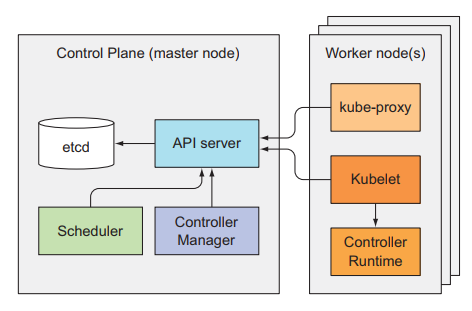

## Kubernetes机理

#### 1. Kubernetes架构
* kubernetes的组件
  * Kubernetes Control Plante控制面板：kubelet（如果要在master运行控制面板组件的pod），etcd分布式持久化存储；API服务器；etcd分布式持久化存储；scheduler调度器；controller manager控制器管理器
  * (Worker) Nodes工作节点：kubelet；kubelete服务代理（kube-proxy）；container runtime容器
  * ADD-ON components附加组件：kubernetes DNS服务器；dashboard仪表盘；Ingress 控制器；heapster(容器监控插件)；容器网络接口插件；
    ```shell
    $ sudo kubectl get componentstatuses #查看各个组件健康状态
    ```
* 分布式特性
  * 各组件之间的依赖关系
  
  * 组件间通信：
    * 只能通过API服务器，其他组件不直接与API服务器通信，而是通过API服务器来修改集群状态。
    * 通常与API服务器的连接由组件发起，但是**获取日志**、**kubectl attch(附着到主程序)**、**port-forward**时候由API发起
    * 工作节点的组件运行在**同一节点上**，而控制面板的组件可以分散在**多台服务器**，并且可以有多个实例。etcd和API服务器可以多个实例同时工作而，调度器（scheduler）和控制器管理器（Controller Manager）只能**一个实例运行**，其他处于待命模式。
  * 组件的运行
    * 只有kebuelet要一直作为常规组件运行，**kubeadm 把 kubelet 视为一个系统服务来管理**，其他组件如控制面板组件和kube-proxy可以作为常规程序或者pod运行，若将他们作为pod使用，则要在**master**上安装**kubelet**。
      ```shell
      #指定特定列，并排序
      $ sudo kubectl get po -o custom-columns=POD:metadata.name,NODE:spec.nodeName --sort-by spec.nodeName -n kube-system
      ```
      书上的多节点例子可以看到，控制面板组件全在主节点，工作节点运行kube-proxy和flannel pod
    * **kubernetes运行etcd的机制**
      * etcd是一个key-value的分布式存储，持久化保存pod、rc等的manifest。只有API服务器可以直接与etcd通信，保证了**乐观并发控制**（采用版本号进行控制，在metadata。resourceVersion中），也便于以后更换存储系统
      * etcd v2采用层级键空间，键值对类似文件系统，key可以对应一个包含其他key的目录或正常的值；v3不支持目录但是可以格式包含```/```所以可以认为它被组织成目录。[etcdctl使用参考](https://stackoverflow.com/questions/59412402/errors-when-using-etcdctl-on-kubernetes-cluster-certificates-signed-by-unknown)， etcd v3无法使用ls命令，而且要etcd运行在pod中，要进入容器且认证
        ```shell
        # 查看条目，列出指定前缀
        sudo kubectl -n kube-system exec -it etcd-minikube -- sh -c \
        "ETCDCTL_API=3 ETCDCTL_CACERT=/var/lib/minikube/certs/etcd/ca.crt ETCDCTL_CERT=/var/lib/minikube/certs/etcd/server.crt ETCDCTL_KEY=/var/lib/minikube/certs/etcd/server.key etcdctl get /registry --prefix=true"
        # 或者拆开，先进入pod然后查看亦可
        etcdctl get /registry --prefix=true #全部资源，查看指定前缀
        etcdctl get /registry/pods #全部命名空间
        etcdctl get /registry/pods/default #全部pod
        etcdctl get /registry/pods/default/<podname> #获取json 
        ```
      * 一致性保证
        使用乐观锁机制，同时要求控制面板只能通过API服务器访问存储模块保证一致性。同时为保证高可用性，会运行多个etcd实例并且要求它们保持一致，使用RAFT一致性算法，要求超过半数的成员节点参与更新，可能有脑裂状态，故最好是奇数，对于大集群**5-7个节点足够了**

    * API服务器
      * 以RESTful API的形式提供查询修改集群CRUD接口，并写入etcd
      * 同时还会进行校验，保证不能写入非法对象（直接写入etcd呢？）
      * 处理乐观锁，保证不被别的客户覆盖
      * 处理流程
        1. 认证插件(Authentication plugin)进行认证
          轮流调用多个认证插件，确认发送者，从证书或HTTP标头（第八章）抽取用户名、ID、归属组等信息
        2. 授权插件(Authorization plugin)进行授权
          检查用户对请求的资源是否有执行请求的操作的权限
        3. 准入插件(Admission plugin)验证修改请求
          针对C、U、D操作，会修改资源，包括设置漏配字段为默认值等，可以在[官方文档](https://kubemetes.io/docs/admin/admission-controliers/)查看，包括AlwaysPullImage，ServiceAccount(设置默认账号)，NamespaceLifecycle等
        4. 通过之后写入etcd返回响应给客户端 
        
    * API 服务器向客户通知资源变更
      API服务器不会去创建pod或者管理SVC的端口，也不会通知控制管理器具体任务，它只是启动控制器已经一些组件来监控任务变更，注意kubectl也是客户端之一
      ```shell
      #通过watch参数监听CUD操作
      sudo kubectl get po --watch 
      sudo kubectl get po -o yaml --watch 
      ````
      如下图描述了用户监听、kubectl发起变更的流程
      
    * Scheduler 调度器
      scheduler利用API服务器的监听机制等待创建新的pod，然后scheduler通过API服务器更新pod的定义，API服务器通知对应节点上kubelet（利用监听机制），kubelet创建并运行pod的容器。
      * 默认调度，过滤出可以节点，按照优先级进行分配
      * 高级调度，16章；多个scheduler可以通过pod的schedulerName选择，默认调度器为default-scheduler
    * controllerManager控制器管理器
      API服务器负责在etcd存储资源和向客户端通知变化（监听），调度器分配节点，控制器和管理器控制系统的实际状态符合定义
      * 控制器包括：Replication管理器；RS、DS、Job控制器、Service控制器、Namespace控制器等等，对应资源
      * 如何工作：通过API服务器监听资源的变更，定期执行，将集群的实际状态调整为期望状态(spec定义)，通过监听机制来获取变更。源码可以[查看](https://github.com/kubernetes/kubernetes/blob/master/pkg/controller)
      * Replication管理器：通过监听replicas数量变化，与期望数量进行比对。只是将pod清单发到API服务器，由scheduler调度，kubelet去创建运行。RS、DS、Job控制器类似
      * Deployment，每次修改后创建新的RS，执行滚动更新
      * Serviece，其中LoadBalancer复制在LB类型的SVC在创建或删除时向基础设施请求和释放**负载均衡器**
      * Endpoint控制器，同时监听SVC和Pod，在其变动时，将selector匹配的Pod的IP和端口写入Endpoint
      * Namespace、PV等等资源都有
      * 唤醒控制器：控制器通过API服务器操作，不直接与kebelet和kubernetes Service Proxy通信，由他们去启动pod，加载存储或者创建跨pod负载均衡等具体工作
  * kubelet的工作
    负责运行在工作节点上的内容，第一个任务是在API服务器创建Node资源，然后监听API服务器，启动和监控容器，向API报告运行状况，同时也更以根据本地目录的manifest创建pod（可以用于运行控制面板组件）
  * kubernetes Service Proxy服务代理
    在每个节点运行kube-proxy，确保多服务IP和端口的连接可以到达某个具体pod。通过iptable（Linux**内核**数据包过滤功能的工具）进行代理，不进入kube-proxy，而是由kube-proxy陪着iptable规则进行转发
  * add-on插件
    非必要，如DNS查询，ingress，dashboard等
    * kube-dns，默认用集群内部的DNS服务器，便于查询服务的IP。服务器地址在```/etc/resolv.conf```中用```nameserver```定义。
    1. kuibe-dns Pod订阅svc和endpoint的变化修改dns记录
    2. Ingress运行一个反向代理如nginx，监听svc和endpoint，此外ingress的代理会直接将流量转发到pod不经过svc

#### 2. 控制器流程
  * 以deployment部署为例，在开始前，各个控制器已经就绪，这里省略了etcd，所有对象都通过API服务器存储在上面
    
  * 在kubectl提交deployment的创建，kubectl通过HTTP POST请求发送manifest到kubernetes服务器，存储在etcd中
    
  * 观察集群事件
    ```shell
    sudo kubectl get events --watch
    ```

#### 3. 什么是pod
  创建pod后检查docker
  ```shell
  sudo kubectl run nginx --image=nginx
  sudo docker ps
  luksa/kubia-pet-peers                                           "node app.js" 
              k8s_kubia_kubia-0_default_1c1a9fd5-3bc7-41a8-8160-dda7d41610b1_0
  registry.cn-hangzhou.aliyuncs.com/google_containers/pause:3.1   "/pause"    
              k8s_POD_kubia-0_default_1c1a9fd5-3bc7-41a8-8160-dda7d41610b1_0
  ```
  可以看到一个执行命令为```/pause/```的docker附加容器，时间比```node app.js```早，讲pod的所有容器保持共享的命名空间

#### 4. 跨pod网络 
* kubernetes本身不进行网络的建立，是由Container Nertwork Interface插件建立的。Kubernetes要求某个pod的IP与它在其他pod看来的IP是一致的，即pod-dst收到网络包的源地址必须与pod-src的地址一致，亦即没有NAT地址转换，源地址和目的地址不变，pod与节点的通信也无NAT。而且pod与外部通信时，pod发出网络包时候的源地址也不需要改变，因为通过主机发送会被改成主机IP。

* 具体的工作原理
  * 同节点通信：创造虚拟以太网Ethernet接口对，节点端为vethXX（ifconsig可查看），容器端均为eth0。主机端接到网桥上，从网桥的IP段给eth0分配IP，数据从**eth0-->vethXX-->网桥**
  
  * 不同节点：可以通过三层路由，要求集群内pod的IP唯一，即网桥的IP不能重叠，如节点A用```10.1.1.0/24```（指前24位为分类号和网络号），节点B为```10.1.2.0/24```，设置好节点A、B路由表（直接转发不经过路由器）。只在相同网关、没有路由时有效，因为一般交换机是LAN口，ping的时候ARP可以正常转发得到彼此的MAC，但是路由器在3层，是WAN口，对私有IP会丢包。可以用SDN软件定义网络，对pod的报文进行封装
  
  * 引入容器接口CNI：用deamonSet部署即可，启动kubelet时加上```--network-plugin=cni```参数

#### 5. 服务是的实现
* kube-proxy：svc的IP是虚拟的，不会被分配给网络接口，也不会真的作为数据包的地址，所以**无法Ping通**
* 使用Iptable：监控svc和endpoint，当svc创建时，API服务器通知所有节点上的kube-proxy客户端，然后kube-proxy创建一些iptable规则使得dst为svc的ip端口的包地址改为svc对应的pod的地址

如上图，节点A在svc和endpoint变化是修改自己的iptable规则，即修改源地址的节点

#### 6. 集群高可用
  * 水平扩展集群，用deployment部署，即使副本数为1，也可以便于重启
  * 采用选举机制，备用事例代价，一个[例子](https://github.com/kubernetes/contrib/tree/master/election)
  * etcd和API服务器可以多实例，控制器和调度器不行，因为它们监听、修改(通过API服务器写etcd)集群状态，会长生竞争。可以采用选举机制(用```--leader-elect```参数，默认为true)
  * 选举实现：**创建一个endpoint**或其他资源（endpoint的优点在于只要没有同名svc就没有副作用），因为一致性采用**乐观锁控制**，所以只会有一个实例创建成功，并负责更细资源，一旦宕机，其他实例发现会取代它。如scheduler会创建```kube-scheduler```（同理有```kube-dns```，```kube-controller-manager```等等）
    ```shell
    sudo kubectl get endpoints kube-scheduler -n kube-system -o yaml
    ```


#### 安装etcd
```shell
wget https://github.com/etcd-io/etcd/releases/download/v3.4.13/etcd-v3.4.13-linux-amd64.tar.gz
tar zxvf etcd-v3.4.13-linux-amd64.tar.gz
mv etcd-v3.4.13-linux-amd64/etcdctl /usr/bin
```