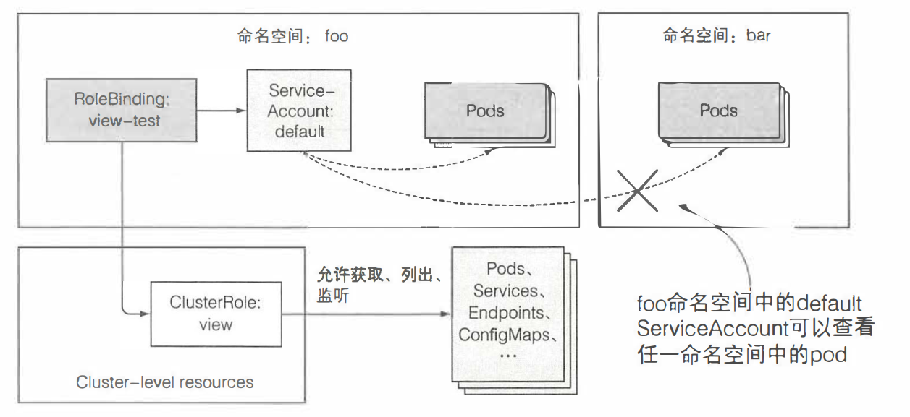

## API服务器安全防护

#### 1. 认证机制
* API服务器通过**认证插件**的列表提取请求中的用户名、IP、组信息以确定请求的发送者，可用的方法有：证书、HTTP验证、HTTP头中发token验证等
* 用户和组：认证插件返回用户的用户名和组的信息，只用于验证，**不会被存储**
  * 客户端可以分为两种
    * 真实的人（用户），在外部系统如单点登陆系统（SSO）管理，不能通过API服务器进行管理
    * pod（运行在pod中的应用），用service account资源进行管理
  * 组：插件返回的组仅仅是组名字符串，系统内置的组有：
    * system:unauthenticated 所有认证插件都不会通过
    * system:authenticated 自动分配通过认证的用户
    * system:serviceaccounts 全部serviceAccount
    * system:serviceaccounts:<namespace> 特点命名空间中的serviceAccount
* serviceAccount介绍
  * pod通过```/var/run/secrets/kubernetes.io/serviceaccount/token```文件进行身份认证。pod与serviceAccount相关联，通过卷挂载持有认证token。应用程序使用token连接API服务器，API服务器通过token认证serviceAccount进行身份认证，将如下用户名传入**授权插件**：
    ```
    system:serviceaccount:<namespace>:<service account name>
    ```
  * serviceAccount资源，目前只有```default```的sa，注意一个pod可以包含多个sa，**pod和sa必须在命名空间**。
    ```
    sudo kubectl get sa
    ```
    API服务器用管理员配置好的系统级别认证插件，验证发送token的pod所关联的sa是否有执行请求操作的权限
  * 创建serviceAccount
    ```shell
    $ sudo kubectl create serviceaccount foo
    $ sudo kubectl describe serviceaccount foo
    Name:                foo
    Namespace:           default
    Labels:              <none>
    Annotations:         <none>
    Image pull secrets:  <none> #会自动添加到pod
    Mountable secrets:   foo-token-nxrzd #若强制使用可挂载密钥则pod只能用这些
    Tokens:              foo-token-nxrzd
    Events:              <none>
    ```
    sa自动创建了secret```foo-token-nxrzd```（为JWT认证token）,secret有**ca.crt、namespace、token**三个条目    
    * 可挂载密钥列表：默认情况pod可以挂载任何secret，可以在sa中开启强制挂载：在注解annotation中包含```kubernetes.io/enforce-mountable-secrets='true'```，这样挂载该sa的pod只能挂载列表中的secret
    * 从镜像拉取密钥，密钥secret可以从docker私有仓库中拉取，sa包含secret后，secret会被自动添加到引用sa的pod中
      ```shell
      # 第七章手动创建的镜像拉取secret
      sudo kubectl create secret docker-registry my-dockerhub-secret \
      --docker-username=myusername \
      --docker-password=mypassword \
      --docker-email=my.email@provider.com
      ```
      ```yaml
      apiVersaion: v1
      kind: SecretAccount
      metadata:
        name: my-sa
      imagePullSecret:
      - name: my-dockerhub-secret #包含secret
      ```
  * 将sa分配给pod
    只能在pod**创建**时，在```spec.serviceAccountName```字段进行配置。例子，修改第8章ambassador代理的pod，使其包含foo
      ```yaml
      #./curl-custom-sa.yaml
      apiVersion: v1
      kind: Pod
      metadata:
        name: curl-custom-sa
      spec:
      serviceAccountName: foo
        containers:
        - name: main
          iamge: curlimages/curl
          command: ["sleep","9999999"]
        - name: ambassador
          image: luksa/kubectl-proxy:1.6.2
      ```
      查看token与foo-token-nxrzd一致
      ```shell
      sudo kubectl exec -it curl-custom-sa -c main cat \
      /var/run/secrets/kubernetes.io/serviceaccount/token
      ```
      尝试与API服务器通信，注意该pod开启了代理
      ```shell
      $ kubectl exec -it curl-custom-sa -c main curl localhost:8001/api/v1/pods
      ```

#### 2. RBAC 基于角色的权限控制
SA的用处在于，限制可挂载密钥，提供镜像拉取密钥，现在引入RBAC授权插件
* 动作：API服务器暴露RESTFUL接口。客户端可以发送GET、POST、PUT、DELETE请求到特定URL上，URL对应pod、service等资源，RBAC**授权插件**判断是否允许在资源上执行动作，额外的动词use用于PodSeurityPolicy

  |HTTP方法|单一资源动作|资源集合动作|
  |---|---|---|
  |GET, HEAD|get（以及watch）用于监听|list（以及watch）|
  |POST|create|n/a|
  |PUT|update|n/a|
  |PATCH|patch|n/a|
  |DELETE|delete|deletecollection|

RBAC规则可以对应一类资源，也可以对应某类实例，甚至非资源url(ru、healthz或者/api本身)。主体(一个人、一个sa、一组用户或sa)可以对应一个或多个**角色**，角色有各种动作的权限。
* RBAC资源四种资源分为两组：
  * Role、ClusterRole，角色和集群角色，指定在资源上可以执行哪些动作（可以做什么）
  * RoleBinding、ClusterRoleBinding，绑定和集群绑定，将角色绑定到特定用户、组或ServiceAccount（谁做）
  * 角色和角色绑定是单个**命名空间**中的资源；集群角色和集群角色绑定的是**集群级别的资源**，角色绑定也可以引用集群角色
  
* RBAC使用
  * 在GKE中，创建集群时使用```--no-enable-legacy-authorization```禁用老版本授权，在minikube可能需要```--extra-config=apiserver.Authorization.Mode=RBAC```
  * 恢复RBAC功能：在第八章中已经设置为赋予了全部权限，如下
    ```shell
    $ sudo kubectl create clusterrolebinding permissive-binding \
    --clusterrole=cluster-admin \
    --group=system:serviceaccounts
    ```
    这里可以先删除该clusterrolebinding
    ```shell
    $ sudo kubectl delete clusterrolebinding permissive-binding
    ```
  * 创建命名空间和pod，用之前的ambassador镜像
    ```shell
    $ sudo kubectl create ns foo
    $ sudo kubectl create ns bar
    $ sudo kubectl run test --image=luksa/kubectl-proxy:1.6.2 -n foo
    $ sudo kubectl run test --image=luksa/kubectl-proxy:1.6.2 -n bar
    ```
  * 尝试在pod中访问API server以查看全部服务，由于此时删除了clusterrolebinding，自然没有权限
    ```shell
    $ sudo kubectl exec -it test -n foo sh
    / $ curl localhost:8001/api/vl/namespaces/foo/services #此时打开了ambassador容器
    # 返回403
    ...
    "message": "services is forbidden: User \"system:serviceaccount:foo:default\" cannot list resource \"services\" in API group \"\" in the namespace \"foo\
    ...
    ```
    可以看到API服务器用foo空间默认的```system:serviceaccount:foo:default```sa进行认证，该sa没有权限
  * 使用Role和RoleBinding
    * 创建Role
    Role资源定义了哪些操作（HTTP请求）可以在哪些资源上执行，下面的Role允许用户get并list全部svc，资源名必须使用**复数**,如果之开放部分sec可以用resourceName进行限定
    用yaml文件在foo中创建
      ```yaml
      ./service-reader.yaml
      apiVersion: rbac.authorization.k8s.io/v1
      kind: Role
      metadata:
        namespace: foo #指定命名空间
        name: service-reader
      rules:  #使用多个apiGroup资源时可以采用
      - apiGroups: [""] #svc是核心apiGroip资源，没有apiGroup名
        verbs: ["get", "list"] #
        resources: ["services"] #使用复数
      ```
      ```shell
      $ sudo kubectl create -f service-reader.yaml -n foo
      ```
      用命令行在bar中创建
        ```shell
        $ sudo kubectl create role service-reader --verb=get --verb=list --resource=services -n bar
        ```
    * 绑定Role到ServiceAccount
      角色Role可以绑定到一个user、ServiceAccount、或者一个组（user组或sa组）。创建一个RoleBinding资源将Role绑定到foo的默认serviceAccount上。
        ```shell
        $ sudo kubectl create rolebinding test --role=service-reader --serviceaccount=foo:default -n foo
        #用--user参数可以绑定到用户上
        #用--group参数可以绑定到组
        ```
      此时foo的默认sa有了列出svc的权限，而之前的pod text包含默认svc，尝试在foo的pod中访问service。
      ```shell
      $ sudo kubectl exec -it test -n foo sh
      / $ curl localhost:8001/api/v1/namespaces/foo/services
      {
        "kind": "ServiceList",
        "apiVersion": "v1",
        "metadata": {
          "selfLink": "/api/v1/namespaces/foo/services",
          "resourceVersion": "694921"
        },
        "items": [] #成功获取，为空
      }
      ```
      当然bar的test pod不能访问其命名空间的服务，修改foo中的test绑定使其引用bar中的默认sa，但是此时bar中的pod test只能列出**foo中的svc**，即roleBinding可以引用其他空间的role，可以跨空间访问
      ```shell
      $ sudo kubectl edit rolebinding test -n foo
      #加上
      subjects:
      - kind: ServiceAccount
        name: default
        namespace: bar #foo中的rolebinding引用了bar空间的sa
      ```
      

  * 使用ClusterRole和ClusterRoleBinding
    属于集群级别的资源，不在命名空间内。对于**集群资源(没有命名空间)**如Node，PersistentVolume，NemaSpace等，或者**非资源URL**如/healthz，只能通过ClusterRole授权。
    * 访问集群级别资源
      以persistentVolume为例，使pod可以列出pv，首先创建一个pv-reader
      ```shell
      $ sudo kubectl create clusterrole pv-reader --verb=get,list --resource=persistentVolumes #复数
      ```
      创建一个**rolebinding**进行绑定
      ```shell
      $ sudo kubectl create rolebinding pv-test --clusterrole=pv-reader --serviceaccount=foo:default -n foo
      #此时在foo的pod中仍然无法curl pv
      ```
      RoleBinding可以引用ClusterRole访问命名空间内的资源，但是不能访问**集群资源**，可以用ClusterRoleBinding访问
      ```shell
      $ sudo kubectl delete rolebinding pv-test -n foo
      $ sudo kubectl create clusterrolebinding pv-test --clusterrole=pv-reader --serviceaccount=foo:default
      ```
      
    * 访问非资源URL
      通常非资源URL通过叫system:discovery名字的ClusterRole和ClusterRoleBinding授权 
      ```shell
      #通过get yaml查看
      $ sudo kubectl get clusterrole system:discovery -o yaml
      ...
      metadata:
        annotations:
          rbac.authorization.kubernetes.io/autoupdate: "true"
        name: system:discovery
      ...
      rules:
      - nonResourceURLs: #使用URL匹配
        - /api
        - /api/*
        - /apis
        - /apis/*
        - /healthz
        - /openapi
        - /openapi/*
        - /version
        - /version/
        verbs:
        - get #限定get方法
      ```
      查看ClusterRoleBinding
      ```shell
      #通过get yaml查看
      $ sudo kubectl get clusterrolebinding system:discovery -o yaml
      ...
      roleRef:
        apiGroup: rbac.authorization.k8s.io #指定组
        kind: ClusterRole
        name: system:discovery #引用clusterRole
      subjects:
      - apiGroup: rbac.authorization.k8s.io
        kind: Group
        name: system:authenticated #这里只绑定了authenticated组，书上的例子有unauthenticated
      ```
      可以直接从pod用API server的ip访问，此时用proxy反而无法访问
      ```shell
      / $ curl https://192.168.106.10:8443/api -k #这里不可行，因为没绑定unauthenticated组
      # 指定证书可以
      / $ export TOKEN=$(cat /var/run/secrets/kubernetes.io/serviceaccount/token)
      / $ curl -H "Authorization: Bearer $TOKEN" https://192.168.106.10:8443/api -k
      ```
      此外不加token时，认证插件返回的组为匿名```system:anonymous```

    * 用clusterRole授权命名空间的资源
      可以用命名空间内的RoleBinding绑定集群资源ClusterRole，以view为例，可以看到有很多命名空间内和集群内的资源
      ```shell
      $ sudo kubectl get clusterrole view -o yaml
      ... #有
      - apiGroups:
      - ""
      resources:
      - configmaps
      - endpoints
      - persistentvolumeclaims
      - pods
      - replicationcontrollers
      - replicationcontrollers/scale
      - serviceaccounts
      - services
      verbs:
      - get
      - list
      - watch
      ...
      ```
      如果用ClusterRoleBinding绑定ClusterRole，则可以访问**所有命名空间**中的指定资源；若用RoleBinding绑定则只能访问**特定命名空间**的制定资源
      ```shell
      # 创建ClusterRoleBinding
      $ sudo kubectl create clusterrolebinding view-test --clusterrole=view --serviceaccount=foo:default
      #在foo的test pod中，可以访问foo
      / $ curl localhost:8001/api/v1/namespaces/foo/pods/
      #在foo的test pod中，可以访问bar
      / $ curl localhost:8001/api/v1/namespaces/bar/pods/
      #在foo的test pod中，可以访问获取全部pod
      / $ curl localhost:8001/api/v1/pods/
      ```
      
      而如果用RoleBinding进行绑定
      ```shell
      #删除ClusterRoleBinding
      $ sudo kubectl delete clusterrolebinding view-test
      # 创建RoleBinding
      $ sudo kubectl create rolebinding view-test --clusterrole=view --serviceaccount=foo:default -n foo
      #在foo的test pod中，可以访问foo
      / $ curl localhost:8001/api/v1/namespaces/foo/pods/
      #在foo的test pod中，访问bar被拒绝
      / $ curl localhost:8001/api/v1/namespaces/bar/pods/
      #在foo的test pod中，访问获取全部pod被拒绝
      / $ curl localhost:8001/api/v1/pods/
      ```
      
      role和bind的搭配关系
      
  * 默认的role和binding
    通过```get ClusterRoleBindings```和```get ClusteRrole```可以查看默认的角色和绑定，下面列举几个重要的：
    * view ClusterRole：允许**读取**命名空间中除了Role、RoleBinding、secret以外的资源，防止权限扩散
    * edit ClusterRole：允许**读取、修改**命名空间中包括secret在内的资源，除了Role、RoleBinding
    * admin ClusterRole：赋予一个命名空间**全部控制权**，允许读取、修改命名空间中除了ResourceQuota的资源，包括Role、RoleBinding
    * cluster-admin ClusterRole：赋予**整个集群全部控制权**，允许读取、修改命名空间中除了ResourceQuota的资源，包括Role、RoleBinding
    * 其他默认ClusterRole：以```system:```为前缀，如：
      * ```system:kube-scheduler```给调度器使用
      * ```system:kube-node```给Kubelete使用
      * ```system:Controller```作为控制器的前缀，Controller Manager的每个控制器都有独立的ClusterRole和ClusterRoleBinding
  * 理性的授权
    为每个pod创建特定的ServiceAccount并且与定制的(Cluster)Role和(Cluster)RoleBinding联系起来。令pod的spec.serviceAccount字段指向sa来使用