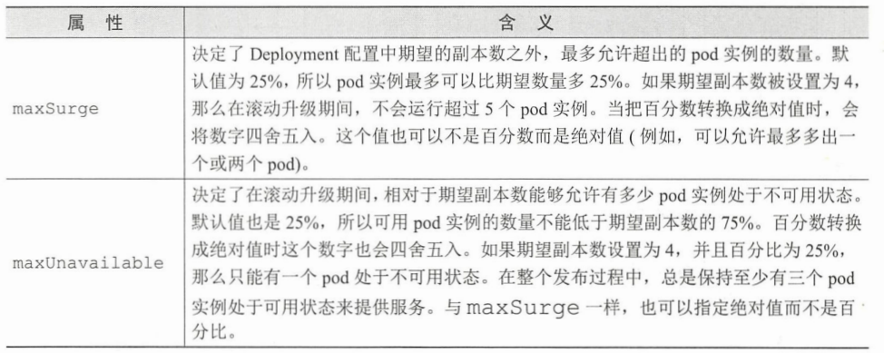

## Deployment

#### 1. 更新pod中的应用
通常的做法，用svc暴露服务，用rc或者rs管理，可能得加个ingress。更新应用只能通过用新的pod换掉原有的：
* 先删除原有的，再构建新的，应用一定时间不可用
* 先构建新的，在删除原有的，有兼容问题和资源需求变多的问题
  * 立即切换：先建好新的RC生成新的pod，然后修改svc的selector把流量切到新的pod。确认新的pod功能稳定后删除旧的
  * 滚动升级： 逐步用新的rc生成pod，令svc进行切换，手动操作复杂且容易出错

#### 2. RC自动滚动更新
* luksa已经push了kubia:v1和kubia:v2两个镜像
  * 手动构造RC和svc在一个yaml manifest中：
    ```yaml
    #./kubia-rc-and-service-v1.yaml
    apiVersion: v1
    kind: ReplicationController
    metadata:
      name: kubia-v1
    spec:
      replicas: 3
      template:
        metadata:
          name: kubia
          labels:
            app: kubia
        spec:
          containers:
          - image: luksa/kubia:v1
            name: nodejs
    ---
    apiVersion: v1
    kind: Service
    metadata:
      name: kubia
    spec:
      type: NodePort #书上是loadBlance，这里改为NodePort
      selector:
        app: kubia
      ports:
      - port: 80
        nodePort: 30124
        targetPort: 8080
    ```
  * 尝试访问该服务：
    ```shell
    $ while true; do curl localhost:30124; done
    ```
  * tag与pull策略:对于tag为latest的情况```imagePullPolicy=Always```每次都会拉取镜像；否则为```IfNotPresent```只在不在的时候拉取，所以push镜像是最好使用不同的tag，否则结点会缓存image导致无法更新

* 自动更新v2版本
  * 在保持循环curl的情况下滚动更新
    ```shell
    $ sudo kubectl rolling-update kubia-v1 kubia-v2 --image=luksa/kubia:v2 #v1.2.0似乎已经取消
    #<old-controller-name> <old-controller-name> --image=<image-name>
    ```
  * 流程：
    * 使用```kubectl describe```查看，一开始v2的desire为0，查看rc，选择器中多了一个deployment标签，但是其值不同，这是为了区分v1和v2。pod中的deployment的值一开始全与v1相同
    * 逐渐加多desire，同时创建v2的pod
  * 缺点：
    * 会直接修改创建的对象，使标签发生变化；查看url资源变化的请求由kubectl客户端进行而不是master进行，如果客户端断网，pod和rc会卡在中间状态

#### 3. 使用Deployment进行升级
  用于部署应用程序并以声明的方式升级应用，RS资源随着deployment创建，便于处理升级过程
  * 创建deployment，因为是高于rc的资源，可以管理多个版本，不用确定版本号
    ```yaml
    #./kubia-deploymen-v1.yaml
    apiVersion: apps/v1
    kind: Deployment
    metadata:
      name: kubia #不需要包括版本号
    spec:         #为指定选择器
      replicas: 3
      template:
        metadata:
          name: kubia
          labels:
            app: kubia
        spec:
          containers:
          - image: luksa/kubia:v1
            name: nodejs
      selector:
        matchLabels:
          app: kubia
    ```
    创建的同时用```-v```记录历史版本，deployment创建rs（数字为模板的哈希值）管理pod。由于selector相同，仍然可以通过之前的svc访问
    ```shell
    $ sudo kubectl delete rc -all
    $ sudo kubectl create -f kubia-deployment-v1.yaml --record #记录历史版本
    # 查看部署进度详细信息
    $ sudo kubectl rollout status deployment kubia
    deployment "kubia" successfully rolled out
    # 查看rs，数字为模板的哈希值
    $ sudo kubectl get rs
    NAME               DESIRED   CURRENT   READY   AGE
    kubia-66b4657d7b   3         3         3       83s
    ```
    
  * 升级pod，只需要修改deployment即可
    * Recreate，一次删除全部pod后重建，服务会短暂停顿
    * RollingUpdate滚动更新，默认策略，可以设置期间副本数的上下限来来保证服务稳定

  * 使用滚动升级
    * 减缓滚动升级的速度，用patch命令更新单个属性（修改资源总结见最后）
      ```shell
      $ sudo kubectl patch deployment kubia -p '{"spec": {"minReadySeconds":10}}'
      #单开一个终端
      $ while true; do curl 10.105.233.215:80; done #ip用svc的ip
      ```
    * 触发升级，改动镜像即可，v1逐渐变为了v2
      ```shell
      $ sudo kubectl set image deployment kubia nodejs=luksa/kubia:v2
      ```
    * 在kubernetes的控制器上进行升级而不是客户端，更加简单可靠，此外CM和secret的变动**不会触发升级**，可以新建CM让deployment指向它。
  
  * 版本回滚
    更新v3版本，在五个请求之后返回内部服务错误500，实验```rollout```命令对deployment进行处理
    ```shell
      $ sudo kubectl set image deployment kubia nodejs=luksa/kubia:v3
      $ sudo kubectl rollout status deployment kubia #检查更新进度
      $ while true; do curl 10.105.233.215:80; done #检查服务，开始出错
      # 版本回滚
      $ sudo kubectl rollout undo deployment kubia
      # 查看版本信息
      $ sudo kubectl rollout history deployment kubia
      # 查看具体某个版本的详细信息
      $ sudo kubectl rollout history deployment kubia --revision=3
      # 退回到具体版本
      $ sudo kubectl rollout undo deployment/kubia --to-revision=1
    ```
    deployment会保留历史版本（带有hash值），以备历史回滚，可以设施revisionHistoryLimit来限制rs数量（extensions/v1btea1版本默认10）

  * 控制升级速率
    使用maxSurge和maxUnavailable来控制更新速度，在extensions/beta1中默认1，1，其实是保证：可用数目>=(期望数目-maxUnavailable)
    ```yaml
    spec:
      strategy:
        rollingUpdate:
          maxSurge: 1
          maxUnavilable: 0
        type: RollingUpdate
    ```
    
  
  * 暂停滚动
    此时（可能）刚好创建一个新的pod，接入部分服务，相当于金丝雀发布。在恢复时可以多此修改deployment，在完成后再恢复
    ```shell
    # 升级到v4
    $ sudo kubectl set image deployment kubia nodejs=luksa/kubia:v4
    # 暂停
    $ sudo kubectl rollout pause deployment kubia
    # 继续回滚
    $ sudo kubectl rollout resume deployment kubia
    ``` 

  * 阻止出错版本的滚动
    * minReadySeconds指定pod知识**成功运行**多久之后被视为可用。Pod当全部容器**就绪探针readinesss**返回成功之后为就绪，等待一定时间后继续更新，作为安全的缓冲。
    * 添加就绪指针
      ```yaml
      ./kubia-deployment-v3-with-readiness
      apiVersion: apps/v1beta1
      kind: Deployment
      metadata:
        name: kubia
      spec:
        replicas: 3
        minReadySeconds: 10
        strategy:
          rollingUpdate:
            maxSurge: 1       #每次只新建一个
            maxUnavailable: 0 #不可运行的pod为0，挨个替换
          type: RollingUpdate
        template:
          metadata:
            name: kubia
            labels:
              app: kubia
          spec:
            containers:
            - image: luksa/kubia:v3
              name: nodejs
              readinessProbe:
                periodSeconds: 1
                httpGet:
                  path: /
                  port: 8080
      ```
      修改deployment，发现新的pod不处于ready因为httpGet探针失败，而此时maxUnavailable为0，不会删除旧的pod
      ```shell
      sudo kubectl apply -f ./kubia-deployment-v3-with-readiness
      sudo kubectl get po
      ```
    * 设置更新的deadline，在Deployment.spec中设置progressDeadlineSeconds为其设置ddl

    
#### 总结
* 资源修改
  * edit，默认编辑器打开manifest，修改保存退出即可
  * patch，修改单个属性
    ```shell
    $ sudo kubectl patch deployment kubia -p \ #json格式
    '{"spec": {"template": {"spec": {"containers": [{"name": "nodejs", "image": "luksa/kubia:v2"}]}}}}'
    ```
  * apply，用整个yaml或者json更新对象，不存在则**创建**
  * replace，用整个yaml或者json更新对象，不存在则**报错**
  * set iamge，修改pod、rc、rs、ds、job、deployment的镜像
    ```shell
    $ sudo kubectl set image deployment kubia nodejs=luksa/kubia:v2
    ```
  * deployment命令
    ```shell
    # 创建时保留记录
    $ sudo kubectl create -f <filename> --record
    # 指定新的image更新
    $ sudo kubectl set image deployment kubia nodejs=luksa/kubia:v2
    # 暂停滚动更新
    $ sudo kubectl rollout pause deployment kubia
    # 继续回滚
    $ sudo kubectl rollout resume deployment kubia
    # 查看更新进度
    $ sudo kubectl rollout status deployment <name>
    # 回滚
    $ sudo kubectl rollout undo status deployment <name>
    # 退回到具体版本
    $ sudo kubectl rollout undo deployment/kubia --to-revision=1
    # 查看版本信息
    $ sudo kubectl rollout history deployment kubia
    # 查看具体某个版本的详细信息
    $ sudo kubectl rollout history deployment kubia --revision=3
    ```
