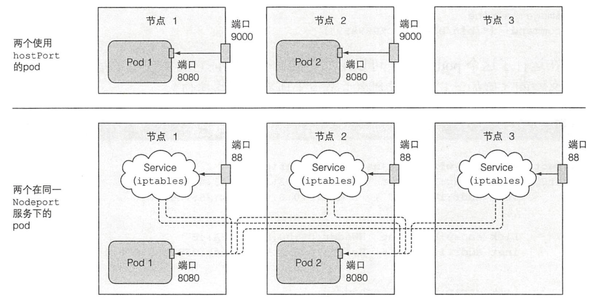

## 节点与网络安全

允许pod访问宿主节点资源；配置集群限制用户通过pod在集群中的操作

#### 1. 在pod中使用宿主节点的Linux命名空间

pod中的容器在分离的命名空间中运行，与其他容器和宿主机隔离。例如网络命名空间（独立的IP和端口），PID空间（独立进程树），IPC命名空间（只能同一pod中的进程通信）
* 在pod中使用宿主的网络命名空间
    一些pod，如系统pod需要使用宿主节点的命名空间来访问节点级别的资源。如在pod中可以将spec.hostNetWork设为true来使用宿主节点的网络适配器，此时该pod**没有独立端口**，而且其某一进程绑定端口时会绑定到**宿主节点的端口上**，可以使用宿主节点的真实设备，例如
    ```yaml
    #./pod-with-host-network.yaml
    apiVersion: v1
    kind: Pod
    metadata:
      name: pod-with-host-network
    spec:
      hostNetwork: true #使用
      containers:
      - name: main
        image: alpine
        command: ["/bin/sleep", "999999"]
    ```
    查看容器的ip地址
    ```shell
    sudo kubectl exec -it pod-with-host-network ifconfig
    ```
  * 仅使用宿主节点的端口，不使用其网络空间
    通过pod的spec.container.ports中的hostport属性实现，配置来使用宿主机的端口，与NodePort的区别在于：
    * 对于hostpost，到达宿主节点后会直接转发到pod对应端口；而NodePort转发到随机选取的pod（可能在别的节点）
    * 在hostport中，仅运行了该类pod的节点会绑定对应端口；而在NodePort中，所有的节点都会绑定端口
    
    此外，当pod绑定hostport时，会占用主机资源，所以一个节点只能调度一个pod（调度器负责），所以在3节点集群调度4个pod，只有3个能成功，剩余1个pending